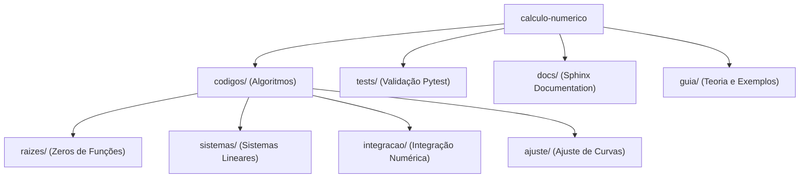

# DESIGN — Cálculo Numérico Architecture & Design Rules

## 1. Organização do Pacote

---

## 2. Princípios de Design

1. **Modularidade:**
   - Cada família de métodos numéricos reside em seu próprio submódulo com interfaces consistentes (assinaturas padronizadas de entrada e retorno).
2. **Robustez:**
   - Todo algoritmo numérico deve verificar pré-condições matemáticas (ex: Teorema de Bolzano para métodos intervalares, não nulidade de pivôs em eliminação gaussiana).
3. **Reprodutibilidade:**
   - Testes unitários com casos de benchmark analíticos para validação de ordem de convergência e tolerância de erro ($\epsilon$).
